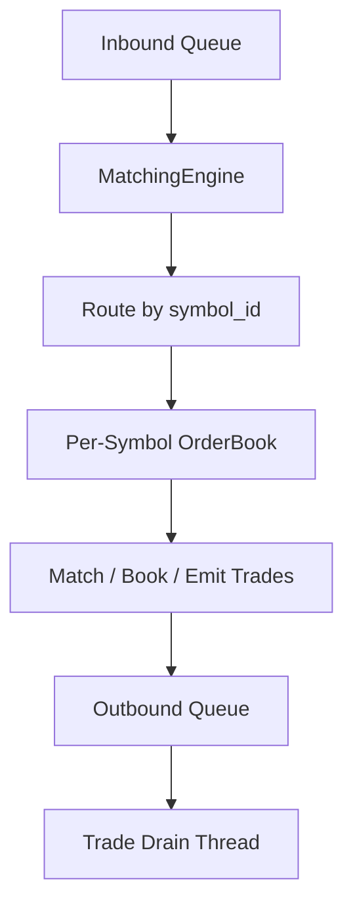

# 📈 HFT Simulator - (LOB & Matching Engine)

This project is a C++17 event-driven matching engine prototype built around a price-time-priority limit order book. It ingests raw order flow from a CSV feed, parses each record into an `Order`, routes by `symbol_id`, matches resting liquidity, and emits `Trade` objects through an outbound queue.

Currently it supports:
- `LIMIT` orders
- `MARKET` orders with IOC-style sweep behavior against available liquidity
- order cancellation for resting orders
- per-symbol order books
- lock-free-style ring-buffer transport between pipeline stages

In building this project, I've also implemented fixed-point prices, cache-aware data layout using alignas(64), thread handoff, and low-overhead file ingestion with `mmap`, and most importantly, leveraging hardware prefetcher.

## Architecture


## Core Components
### `FeedHandler`
- Reads raw input from disk using `mmap`
- Parses side, price, quantity, order type, symbol, and timestamp
- Converts parsed records into strongly typed `Order` objects
- Pushes those orders into the inbound queue

### `RingBuffer`
- Fixed-size circular buffer template
- Uses atomic read/write indices
- Shared transport primitive for both inbound orders and outbound trades
- Enforces bounded capacity and backpressure

### `MatchingEngine`
- Owns the worker thread and inbound event loop
- Pops orders from `inbound_queue`
- Validates `symbol_id`
- Dispatches to the corresponding per-symbol `OrderBook`
- Pushes generated trades into `outbound_queue`

### `OrderBook`
- Maintains bids and asks in price-sorted maps
- Maintains FIFO order priority within each price level via linked lists
- Supports:
  - limit-order matching and book insertion
  - market-order sweeping across available liquidity
  - cancellation by order id
- Emits `Trade` records when executions occur

## Build

```bash
cmake -S . -B build
cmake --build build
```

## Run

```bash
./build/hft_engine
```

It is intended as a compact but complete matching engine prototype rather than a production-ready exchange system.